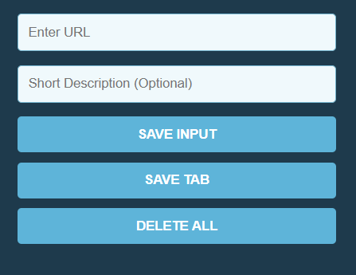

# Leads Tracker Extension

A simple browser extension to save and manage web links with optional short descriptions. Quickly store the current tab or a custom URL, view them in a clean list, and persist data across sessions using localStorage.

---

## 🚀 How to Use:

1. **Download or Clone** the project.
2. Go to `chrome://extensions/` in browser.
3. **Enable Developer Mode** (top right).
4. Click **"Load unpacked"** and select the project folder.
5. Start saving links via the extension popup.

---

## ✅ Features:

- Save current tab with one click  
- Add custom URLs with optional descriptions  
- Prevents duplicate links  
- Local persistent storage  
- One-click delete all

---

Works offline, stores data locally, and requires no sign-in.

